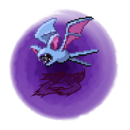

<div align="center">

<p>
    
</p>

<!---  --->

<h1>El lenguaje de scripting FokerScript</h1>

[Documentación](/docs/docs.pdf) |
[Changelog](CHANGELOG.md) |
[Limitaciones](LIMITACIONES.md) |
[Código de conducta](CODE_OF_CONDUCT.md) |
[Contribuciones](CONTRIBUTING.md)

[![Discord][DiscordBadge]][DiscordUrl]

Bienvenido al repositorio oficial del lenguaje de scripting para los juegos de la 3ra generación de Pokémon en GBA. Yeah, este lenguaje funciona solo con el binario (por ahora), si se desea usar un lenguaje parecido o familiar para los proyectos de decompilación, puede recurrir a [Poryscript](https://github.com/huderlem/poryscript), que es desarrollado por el usuario [huderlem](https://github.com/huderlem).

</div>

* * *

## ¿Qué es esto?

**FokerScript** es un nuevo intento de facilitar el desarrollo de scripts en el ROMHacking binario del Pokémon Advance de 3ra Gen. Este lenguaje está inspirado en gran parte por su contraparte para el decomp, **Poryscript**. Este lenguaje transpila el código dado por el usuario al scripting del **XSE (desarrollado por HackMew)**.

A lo largo de estos años, todos los ROMHackers, que han llegado recientemente a este mundillo, han tenido que lidiarse con el scripting del XSE. Debido a su dificultad de escritura, el scripting de XSE ***semi-facilita*** las cosas, por eso, este proyecto intenta quitar ese **semi** de ahí y dejar solo el **facilita**.

* * *

## Objetivos

FokerScript tiene como objetivos los siguientes puntos:

* **Fácil aprendizaje y escritura** - aprender en menos de 1 hora el lenguaje, escribir en menos de 5 minutos un buen script.
* **Sencillez** - no sobrecargar el lenguaje con sintaxis innecesaria.
* **Modularización** - permitir que el usuario pueda reutilizar scripts en otros proyectos sin problemas.

También tiene otro objetivo que está en estado tentativo:

* Transpilar su código a los 2 modos: en binario y en decompilación.

Con este objetivo tentativo deseamos que cualquier script hecho con FokerScript pueda funcionar tanto en el binario como en decompilación, con tan solo algunos ajustes.

* * *

## Backends

Actualmente este es el estado de implementación de los backends en FokerScript:
| Juego             | Binario | Decompilación |
| :---              | :---:   | :---:         |
| Ruby/Sapphire     |         |               |
| FireRed/LeafGreen |         |               |
| Emerald           |         |               |

Las ROMs aquí mencionadas son soportadas tanto en inglés como en español.

* * *

## Compilación e Instalación

Bien, en este apartado nos dedicaremos al proceso de compilación e instalación de FokerScript en nuestras computadoras o laptops. Una cosa debo dejar claro y es que FokerScript solo soporta **Windows** y **Linux** por ahora, **macOS** está por verse en un futuro.

Bien, comencemos con el proceso, primero asegurate de tener instalado lo siguiente:

* Git
* V (en su versión latest de ser posible)

Si no tienes instalado ninguno de los anteriores, pues toca explicar, antes quiero decir que no explicaré como instalar Git, ya que en Google o cualquier otro buscador encontrarás mucha información sobre el proceso de instalación.

Procedo a explicar como instalar V: En alguna carpeta de tu computadora, abriendo el terminal (o ``cmd.exe`` si estás en Windows) escribe, línea por línea, lo siguiente:

```bash
git clone https://github.com/vlang/v
cd v
make # si usas Windows intenta con make.bat
```

Ahora si estás en Linux ejecuta: ``./v symlink``, si estás en Windows usa: ``.\v symlink``

¡Eso es todo! Ya tienes instalado V en tu computadora, ahora solo toca hacer lo mismo con este repositorio:

```bash
git clone https://github.com/Pizcofy/foker
cd foker
v -prod build foker
```

¡Listo! Ya tienes compilado FokerScript, ahora ejecuta ``./fokerscript`` (o en Windows: ``.\fokerscript``), si te muestra algún mensaje de ayuda todo está correcto.

* * *

## Ejemplos de FokerScript

```cs
// Así declaramos los comandos que se usan en el scripting.
extern cmd msgbox(msg: string, type: int = 0x2);
alias msg = msgbox;
```

```cs
script main {
    msg("¡Hola mundo!");
    checkgender {
        boy {
            msg("¡Eres un maestro pokémon!");
        }
        girl {
            msg("¡Eres una estrella pokémon!");
        }
    }
}
```

```cpp
const MIRUTINA_ESPECIAL = 0x80AB24DF;

script main {
    callasm(MIRUTINA_ESPECIAL);
    // Esta sintaxis se usa para declarar variables que, por ejemplo, una rutina utiliza.
    var mirutina_especial_var_usada: long at 0x8013;
    if mirutina_especial_var_usada == 100 or mirutina_especial_var_usada > 200 {
        msg("¡La rutina ha funcionado correctamente!");
    }
     // liberamos la variable utilizada.
    free mirutina_especial_var_usada;
}
```

Por ejemplo, y debido a que algunos me han dicho que no entienden lo anterior, aquí dejo lo que sería la salida posible del ejemplo anterior:

```llvm
#define MIRUTINA_ESPECIAL 0x80AB24D

#org @main
callasm MIRUTINA_ESPCIAL
compare 0x80ABC 0x64
if 0x1 goto @main__if1
clearvar 0x80AB
end

#org @main__if1
msgbox @msg 0x2
end

#org @msg
= ¡La rutina ha funcionado correctamente!
```

Aquí otro ejemplo de lo que sería el soporte de generar scripts tanto para decompilación como binario:

```c++
#if BINARY // si se usa el generador para binario
const RUTINA2 = 0x80ABCD2F;
#else // entonces, si se usa el generador de decomp
extern script script_RUTINA2;
#endif

script main {
#if BINARY
    callasm(RUTINA2);
#else
    script_RUTINA2();
#endif
}
```

El ejemplo anterior se pudiera compilar así: ``fokerscript -g <gen> gen_script.foker``, donde ``<gen>`` pudiera ser ``decomp`` o ``binary``. Ejemplo:

```bash
fokerscript -g decomp gen_script.foker
fokerscript -g binary gen_script.foker
```

Si quiere más ejemplos, vaya a la carpeta [ejemplos](/ejemplos/).

* * *

## Documentación y especificaciones del lenguaje

En [docs.md](docs/docs.md) y [docs.html](docs/docs.html) se encuentra toda la información, puede descargarlo en su dispositivo o verlo directamente en el navegador.

* * *

> Copyright (C) 2020 Pizcofy. Todos los derechos reservados.

<!--- Utilidades --->
[DiscordBadge]: https://img.shields.io/discord/779007353185239070?label=Discord&logo=Discord&logoColor=white
[DiscordUrl]: https://discord.gg/pnvcap7WYT
